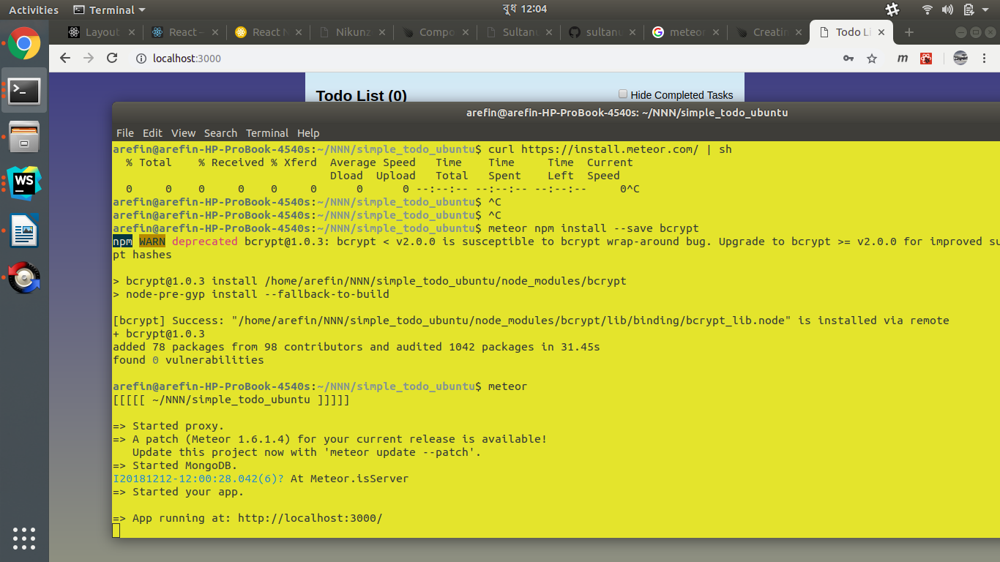

# simple_todo_ubuntu

## Steps

1. Git clone this Repo.
2. Install meteor  [windows : choco install meteor] [cmd as administarator]
3. For Meteor installation of Ubuntu check please check
 Meteor documentation. In windows after adding path 
  restart cmd/shell.
4. open a new cmd/shell instance and form project root run `npm install`
5. from porject directory run `meteor` command.
6. then `meteor npm install --save bcrypt`.
7. Snapshot: 
 produced with this link: 
 https://www.meteor.com/tutorials/react/components 
